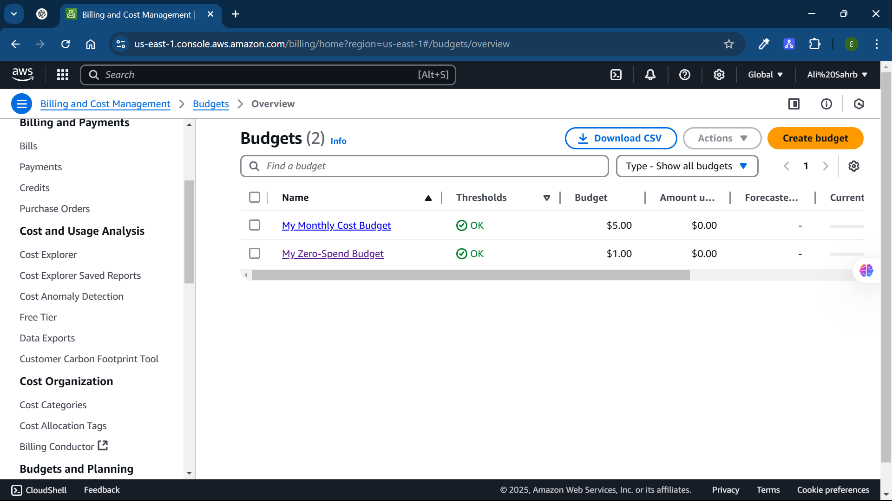
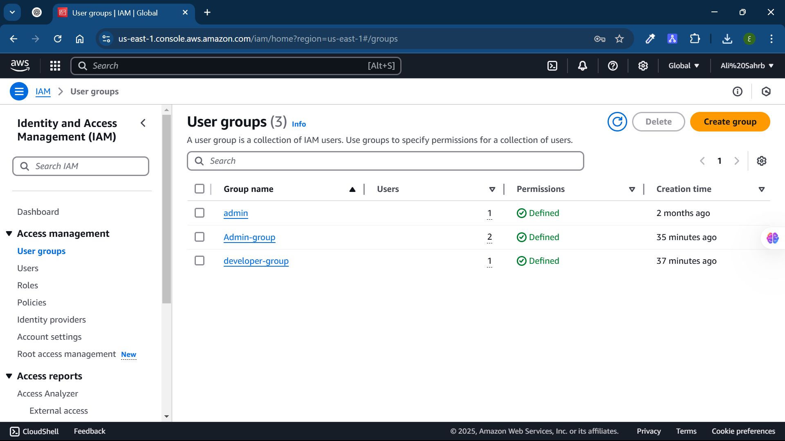
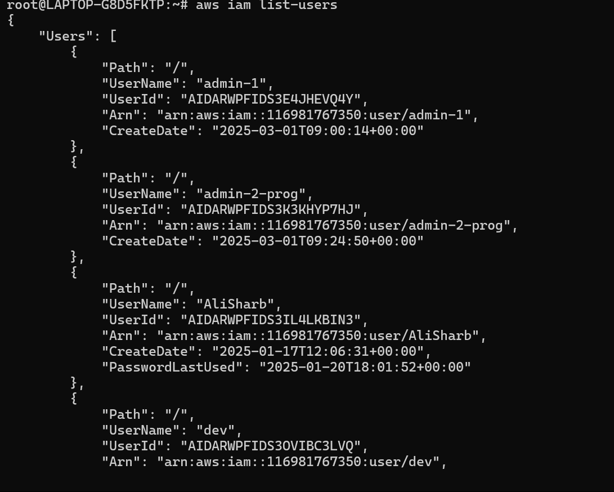
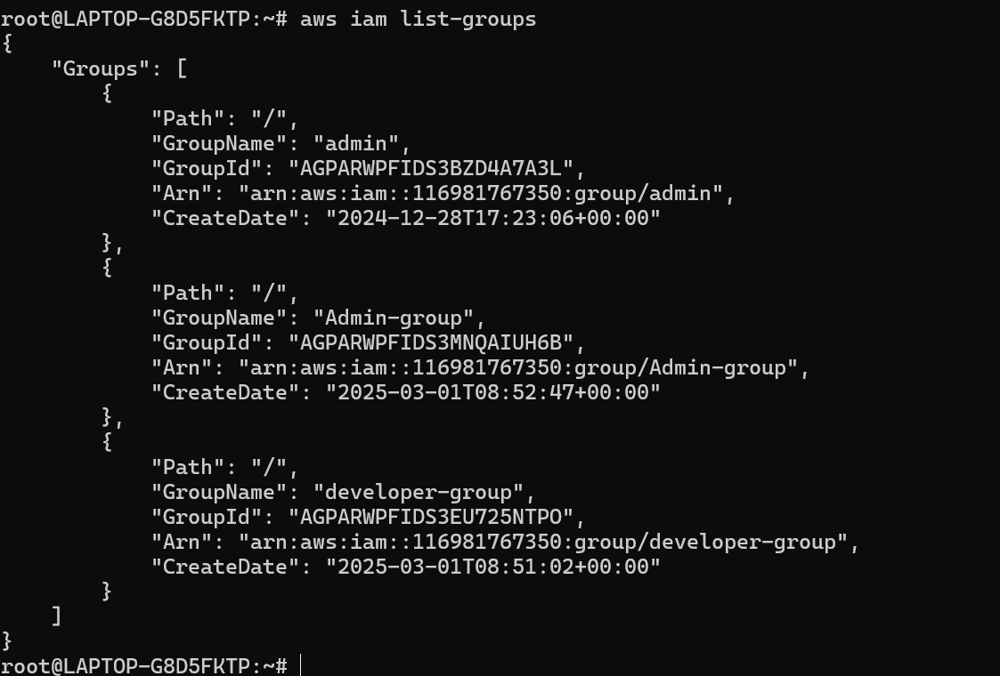
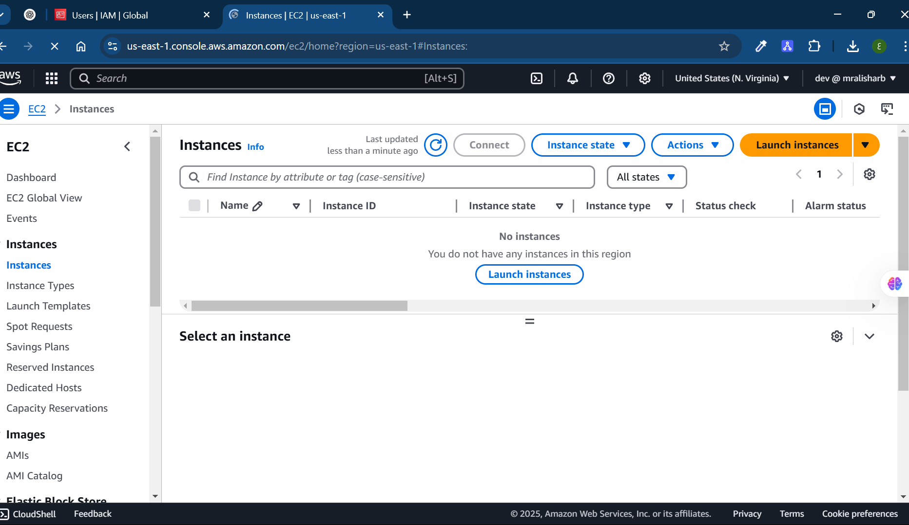
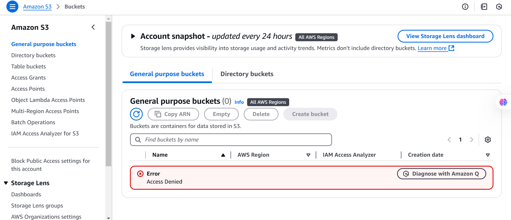

# Lab 11: AWS Security

## Objective
Create an AWS account, set a billing alarm, create IAM groups (admin and developer), assign permissions, create users with specific access types, enable MFA, and list users and groups using AWS CLI commands.

---

## 1. Set a Billing Alarm
1. Go to **AWS Billing Dashboard** → **Budgets**.
2. Click **Create a Budget**.
3. Select **Cost budget** and set a limit (e.g., `$5`).
4. Configure alerts to notify via email.
5. Click **Create budget**.

---

## 2. Create IAM Groups

### Create "admin-group" (Full Admin Access)
1. Go to **AWS IAM** → **User Groups** → **Create Group**.
2. Name: `admin-group`.
3. Attach policy: **AdministratorAccess**.
4. Click **Create Group**.

### Create "developer-group" (EC2 Access Only)
1. Go to **AWS IAM** → **User Groups** → **Create Group**.
2. Name: `developer-group`.
3. Attach policy: **AmazonEC2FullAccess**.
4. Click **Create Group**.

---

## 3. Create IAM Users

### Create "admin-1" (Console Access Only + MFA)
1. Go to **IAM** → **Users** → **Create User**.
2. Name: `admin-1`.
3. Select **Console access**.
4. Set a **custom password**.
5. Assign to **admin-group**.
6. Click **Create user**.
7. Enable **MFA** under **Security credentials**.
8. Use **Google Authenticator** to scan QR code and verify MFA.

### Create "admin-2-prog" (CLI Access Only)
1. Go to **IAM** → **Users** → **Create User**.
2. Name: `admin-2-prog`.
3. Do **not** enable console access.
4. Assign to **admin-group**.
5. Click **Create user**.
6. After creation, go to **IAM → Users → admin-2-prog**.
7. Under **Security credentials**, create an **Access Key**.
8. Download **credentials.csv**.

### Create "dev-user" (Console + CLI Access)
1. Go to **IAM** → **Users** → **Create User**.
2. Name: `dev-user`.
3. Enable **console access** and **programmatic access**.
4. Set a **custom password**.
5. Assign to **developer-group**.
6. Click **Create user**.
7. Download **credentials.csv**.

---

## 4. List Users & Groups Using AWS CLI

### Install AWS CLI
```sh
curl "https://awscli.amazonaws.com/awscli-exe-linux-x86_64.zip" -o "awscliv2.zip"
sudo apt install unzip -y
unzip awscliv2.zip
sudo ./aws/install
```

### Configure AWS CLI
```sh
aws configure
```
Enter:
- AWS Access Key ID
- AWS Secret Access Key
- Default region (e.g., `us-east-1`)
- Default output format (`json`, `table`)

### List Users
```sh
aws iam list-users
```

### List Groups
```sh
aws iam list-groups
```

---

## 5. Verify Dev-User Access to EC2 & S3
1. Sign in as `dev-user`.

2. Navigate to **EC2**:

3. Navigate to **S3**:


---

## Screenshots
Here are the screenshots demonstrating the execution:

1. **Billing Alarm** 

2. **IAM Groups** 

3. **List of Users via AWS CLI**

4. **List of Groups via AWS CLI**

5. **dev-user accessing EC2**

6. **dev-user denied access to S3** 

