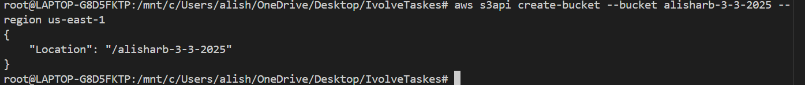
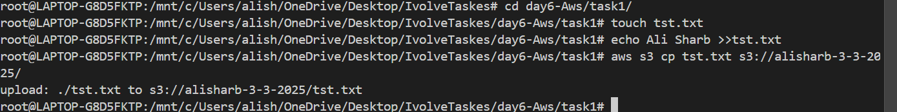
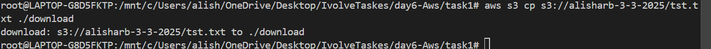
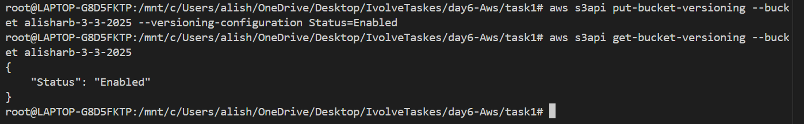
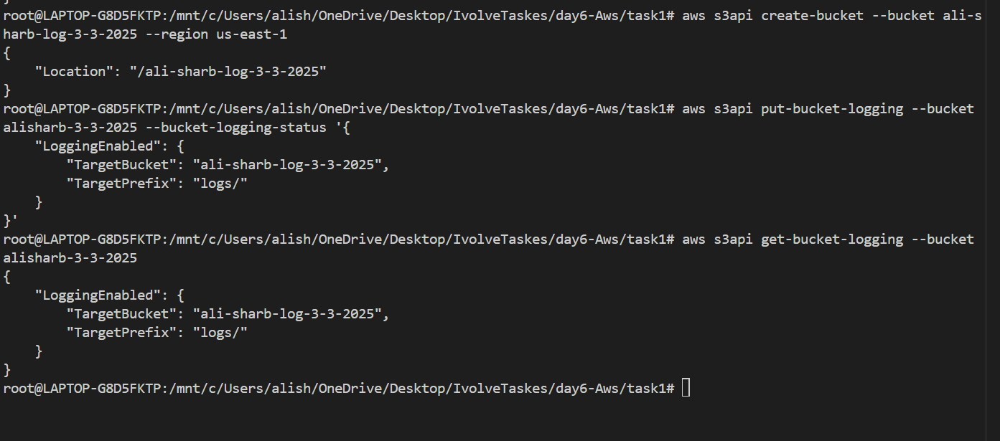

# AWS S3 Bucket Logging and CLI Operations

## **Objective**
This guide outlines how to use the AWS CLI to:
- Create an S3 bucket
- Configure permissions
- Upload and download files
- Enable versioning
- Enable server access logging

## **Prerequisites**
Ensure you have:
- AWS CLI installed and configured (`aws configure`)
- Necessary IAM permissions to create and modify S3 buckets

## **Step 1: Create an S3 Bucket**
```bash
aws   s3api create-bucket --bucket alisharb-3-3-2025 --region us-east-1
```
Verify the bucket:
```bash
aws s3 ls
```

## **Step 2: Upload a File**
```bash
aws s3 cp tst.txt s3://alisharb-3-3-2025/
```
Verify the upload:
```bash
aws s3 ls s3://alisharb-3-3-2025/
```

## **Step 3: Download a File**
```bash
aws s3 cp s3://alisharb-3-3-2025/tst.txt ./download
```

## **Step 4: Enable Versioning**
```bash
aws s3api put-bucket-versioning --bucket alisharb-3-3-2025 --versioning-configuration Status=Enabled
```
Verify:
```bash
aws s3api get-bucket-versioning --bucket alisharb-3-3-2025
```

## **Step 5: Enable Server Access Logging**
Create a logging bucket:
```bash
aws s3api create-bucket --bucket ali-sharb-log-3-3-2025 --region us-east-1
```
Enable logging:
```bash
aws s3api put-bucket-logging --bucket alisharb-3-3-2025 --bucket-logging-status '{
    "LoggingEnabled": {
        "TargetBucket": "ali-sharb-log-3-3-2025",
        "TargetPrefix": "logs/"
    }
}'
```
Verify logging:
```bash
aws s3api get-bucket-logging --bucket alisharb-3-3-2025
```


---

## Screenshots
Here are the screenshots demonstrating the execution:

1. **create bucket** 

2. **upload file** 

3. **download file**

4. **enable versioning**

6. **Create a logging bucket && Enable logging**


