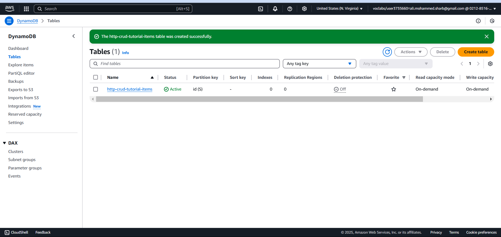
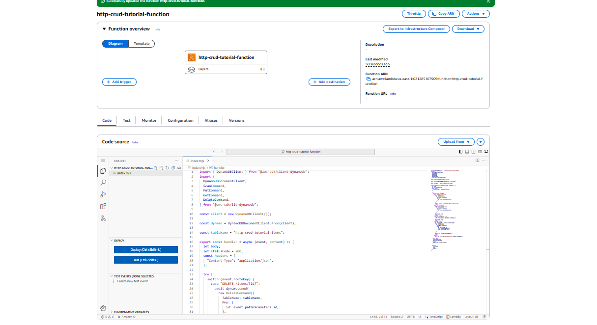
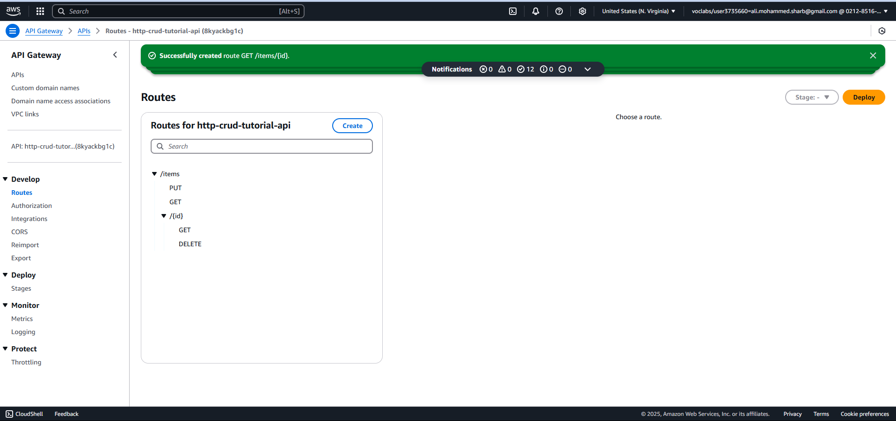
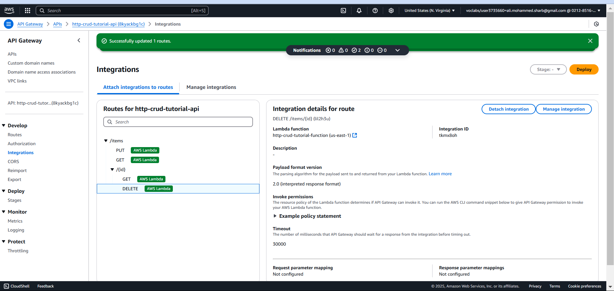
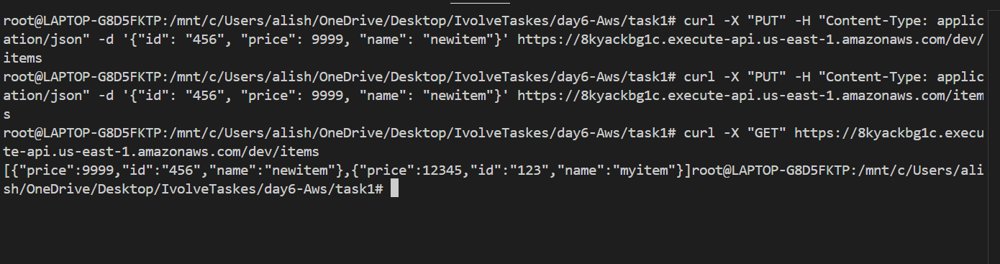

# API Gateway with DynamoDB

This project demonstrates how to integrate Amazon API Gateway with AWS DynamoDB using an HTTP API. The API Gateway will allow you to create, retrieve, update, and delete items in a DynamoDB table without requiring a backend service.

## Steps to Implement

1. **Create a DynamoDB Table**
   - Navigate to the AWS Management Console.
   - Open the DynamoDB service.
   - Create a new table with a primary key.

2. **Create an IAM Role for API Gateway**
   - Go to the IAM service.
   - Create a new role with the necessary permissions to access DynamoDB.
   - Attach the `AmazonDynamoDBFullAccess` policy.

3. **Create Lambda Function**
- Navigate to the AWS Management Console.
- Open the Lambda service.
- Create a new Lambda function.

4. **Create an HTTP API in API Gateway**
   - Open the API Gateway service.
   - Create a new HTTP API.
   - Define routes for CRUD operations.
   - Integrate the routes with DynamoDB actions (PutItem, GetItem, DeleteItem, UpdateItem).

5. **Deploy the API**
   - Deploy the API to a stage (e.g., `dev`).
   - Get the invoke URL to use in your application.

6. **Test the API**
   - Use Postman, cURL, or any HTTP client to test the endpoints.
   - Send requests to create, read, update, and delete items in DynamoDB.

## Example API Endpoints

- **POST** `/items` – Add an item to the DynamoDB table
- **GET** `/items/{id}` – Retrieve an item by ID
- **PUT** `/items/{id}` – Update an item by ID
- **DELETE** `/items/{id}` – Delete an item by ID

---

## Screenshots
Here are the screenshots demonstrating the execution:

1. **create DynamoDB** 

2. **lambda function created** 

3. **api created** 

4. **Attach integration**

5. **Test Api**

