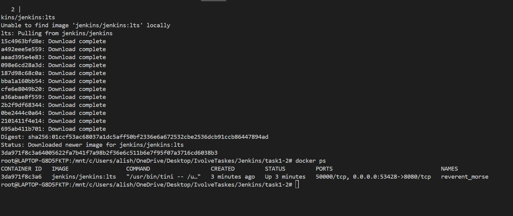
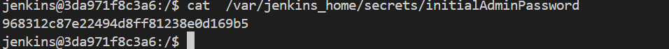
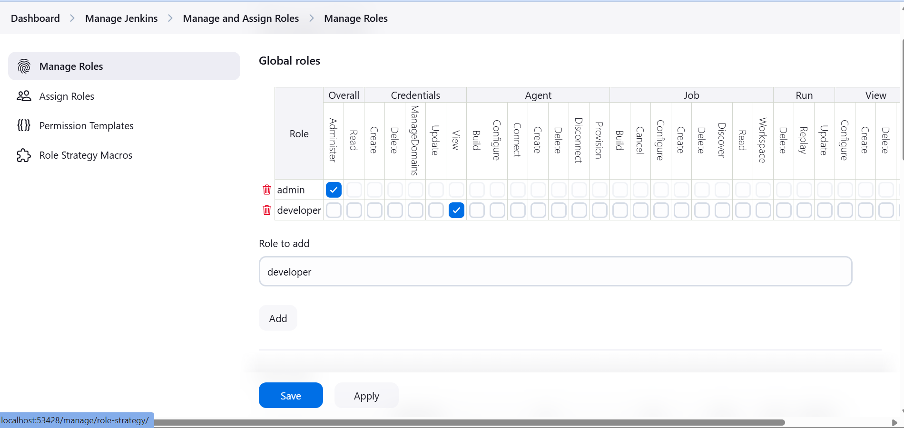

# Jenkins Installation and Role-Based Authorization

## Lab 20: Jenkins Installation
This lab covers the installation and configuration of Jenkins as a container.

### Steps to Install Jenkins as a Container

1. **Pull and Run Jenkins Container**
   ```sh
   docker run -d -p 8080:8080 -p 50000:50000 --name jenkins \
      -v jenkins_home:/var/jenkins_home \
      jenkins/jenkins:lts
   ```
3. **Access Jenkins Web UI**
   - Open a browser and go to `http://localhost:8080`.
   - Retrieve the initial admin password:
     ```sh
     docker exec -it jenkins cat /var/jenkins_home/secrets/initialAdminPassword
     ```
   - Enter the password in the Jenkins UI and proceed with setup.
   - Install recommended plugins.
   - Create an admin user.

## Lab 21: Role-Based Authorization
This lab focuses on setting up role-based authorization in Jenkins.

### Steps to Enable Role-Based Access Control
1. **Install Role-Based Authorization Plugin**

   - Search for `Role-Based Authorization Strategy`.
   - Install the plugin and restart Jenkins.

2. **Enable Role-Based Authorization**
   - Navigate to `Manage Jenkins` > `Configure Global Security`.
   - Select `Role-Based Strategy` under `Authorization`.
   - Save the configuration.

3. **Create User Roles**
   - Go to `Manage Jenkins` > `Manage and Assign Roles` > `Manage Roles`.
   - Create an `admin` role with all permissions.
   - Create a `developer` role with read-only permissions.

4. **Assign Users to Roles**
   - Add `admin` user to the `admin` role.
   - Add `developer` user to the `view` role.
   - Save changes.


---

## Screenshots
Here are the screenshots demonstrating the execution:

1. **run jenkins container** 

2. **password** 

2. **Roles** 


