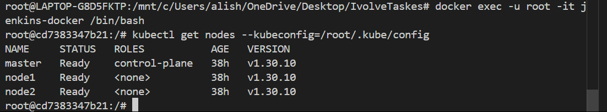
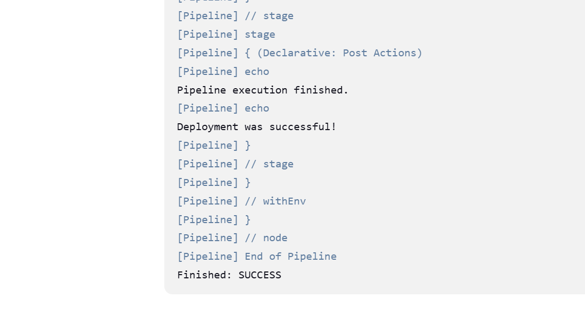
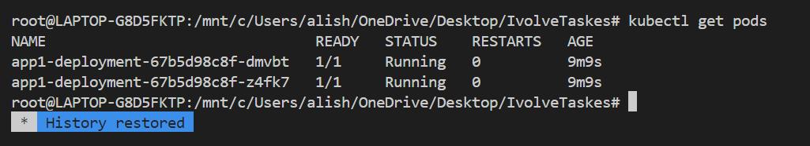
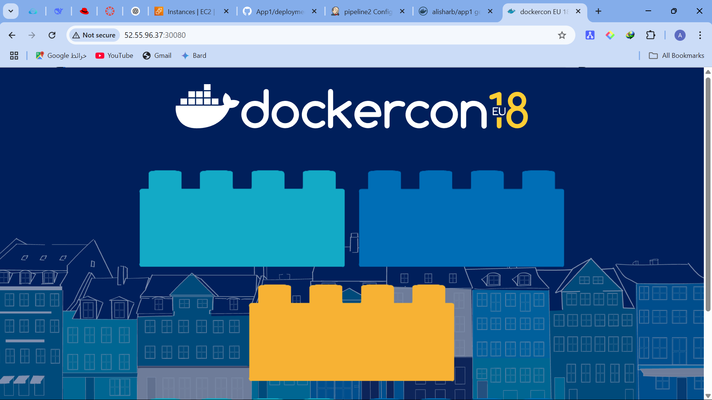
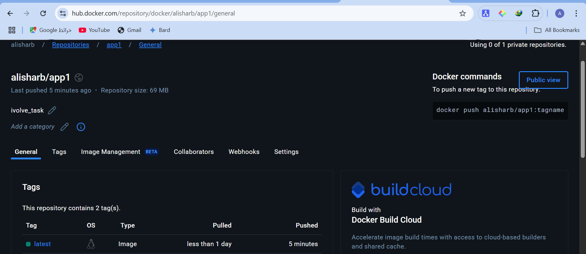

1. **build image from  Docker File**
```sh
 docker build -t my-jenkins-docker .
```


2. **Run the Custom Jenkins Container**
```sh
docker run -d --name jenkins-docker \
  --privileged \
  -p 8080:8080 -p 50000:50000 \
  -v /var/run/docker.sock:/var/run/docker.sock \
  -v ~/.kube:/root/.kube \
  -v jenkins_home:/var/jenkins_home \
  my-jenkins-docker
```

3. **Access Jenkins Web UI**
- Open a browser and go to `http://localhost:8080`.
- Retrieve the initial admin password:
```sh
docker exec -it jenkins cat /var/jenkins_home/secrets/initialAdminPassword
```
- Enter the password in the Jenkins UI and proceed with setup.
- Install recommended plugins.
- Create an admin user.

4. **Configure Kubernetes Access in Jenkins**

```sh
scp ubuntu@y35.172.72.12:~/.kube/config ~/.kube/config
```
5. **Configure Kubernetes Access in Jenkins**
- add creditonal of docker hup
# Jenkins Pipeline for Application Deployment

## Overview
This project automates the deployment of an application using Jenkins, Docker, and Kubernetes. It follows these steps:

1. Build a Docker image from the Dockerfile in GitHub.
2. Push the image to Docker Hub.
3. Remove the local Docker image.
4. Update the Kubernetes deployment YAML file with the new image.
5. Deploy the updated application to the Kubernetes cluster.

## Prerequisites
- AWS EC2 instances (1 master, 2 worker nodes)
- Kubernetes cluster set up with `kubectl`
- Jenkins installed and configured with Docker and Kubernetes
- NodePort service to expose the application

## Setup Commands

### 1. Clone Repository
```sh
git clone https://github.com/IbrahimAdell/App1.git
```

### 2. Build and Run Jenkins with Docker
```sh
docker build -t my-jenkins-docker .
docker run -d --name jenkins-docker \
  --privileged \
  -p 8080:8080 -p 50000:50000 \
  -v /var/run/docker.sock:/var/run/docker.sock \
  -v ~/.kube:/root/.kube \
  -v jenkins_home:/var/jenkins_home \
  my-jenkins-docker
```

### 3. Configure Kubernetes Cluster
```sh
kubectl get nodes -o wide
kubectl get pods
```

### 6. Apply Kubernetes service
```sh

kubectl apply -f service.yaml
```

### 7. Check Running Services
```sh
kubectl get services
kubectl get pods -o wide
```

### 8. Access Application via NodePort
Find the NodePort service:
```sh
kubectl get svc
```
Access the app using:
```sh
http://35.172.72.12:30080
```


---

## **Conclusion**
This guide provides a **fully automated CI/CD pipeline** using Jenkins, Docker, and Kubernetes on AWS. The pipeline builds and deploys an application, ensuring **continuous integration and delivery**.


## Screenshots
Here are the screenshots demonstrating the execution:

1. **access-k8s-from-Jenkins** 

2. **Run pipeline successfully** 

4. **pods** 

5. **access from browser** 

6. **image** 
 


