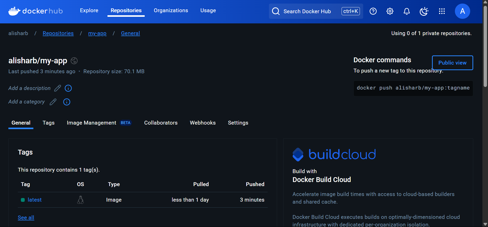

# Lab 23: Jenkins Slave & Shared Libraries

## Overview
In this lab, we will set up a Jenkins slave, use shared libraries, and create a Jenkins pipeline for application deployment. The pipeline will include multiple stages and utilize a shared library to streamline the process.

## Prerequisites
- Two EC2 instances running in AWS:
  - **100.26.208.83**
  - **54.90.68.107**
- Ansible for configuring the Jenkins slave.
- A Kubernetes cluster running on AWS.
- A Jenkins instance running in a Docker container.
- Git repository containing the Dockerfile: [App3 Repository](https://github.com/aliSharb/App3.git)
- Git repository shared library : [shared-lib-jenkins Repository](https://github.com/aliSharb/shared-lib-jenkins.git)

## Step 1: Configure Jenkins Slave using Ansible
1. Create an Ansible playbook.
2. Run the playbook on both EC2 instances:
   ```sh
   ansible-playbook -i inventory slave.yml
   ```

## Step 2: Run Jenkins in a Docker Container
1. Build the Jenkins Docker image:
   ```sh
   docker build -t my-jenkins-docker .
   ```
2. Run the Jenkins container:
   ```sh
   docker run -d --name jenkins-docker \
     --privileged \
     -p 8080:8080 -p 50000:50000 \
     -v /var/run/docker.sock:/var/run/docker.sock \
     -v ~/.kube:/root/.kube \
     -v jenkins_home:/var/jenkins_home \
     my-jenkins-docker
   ```

## Step 3: Create a Shared Library
1. Create a shared library repository.
2. Structure it with `vars/`.
3. Add reusable Groovy scripts for each pipeline stage.

## Step 4: Configure Jenkins to Use Shared Library
1. Navigate to **Manage Jenkins > Configure System**.
2. Under **Global Pipeline Libraries**, add a new library.
3. Set the name, default version, and Git repository URL.
4. Configure library settings and save.

## Step 5: Create a Jenkins Pipeline
1. Create a `Jenkinsfile` in your repository.
2. Reference the shared library in the pipeline.
3. Define stages: `RunUnitTest`, `BuildApp`, `BuildImage`, `PushImage`, `RemoveImageLocally`, `DeployOnK8s`.

## Step 6: Run the Pipeline
1. Navigate to Jenkins and create a new **Pipeline** project.
2. Set it to use the `Jenkinsfile` from the Git repository.
3. Run the pipeline and observe the stages executing.

## Conclusion
This lab demonstrates setting up a Jenkins slave, using a shared library, and automating the CI/CD process for application deployment using Jenkins pipelines. The shared library provides reusable functions across multiple pipelines, improving efficiency and maintainability.

## Screenshots
Here are the screenshots demonstrating the execution:


1. **ansible configuration** 

2. **slave nodes** 

3. **image** 

4. **pods** 

5. **access from browser** 
