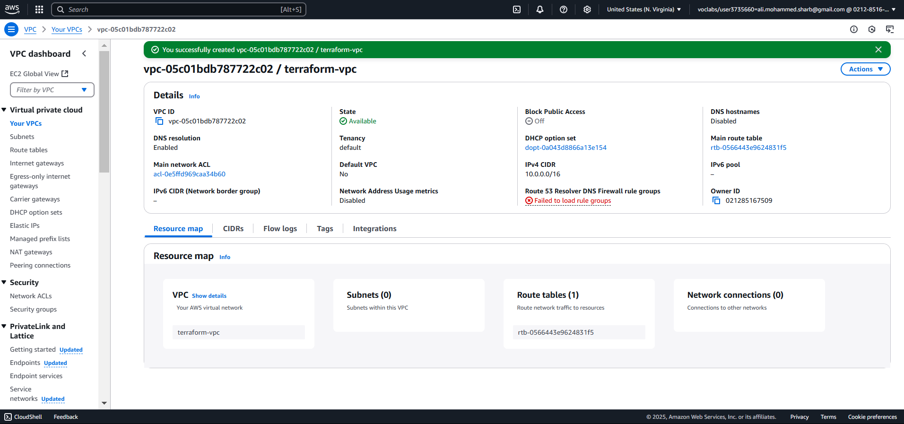
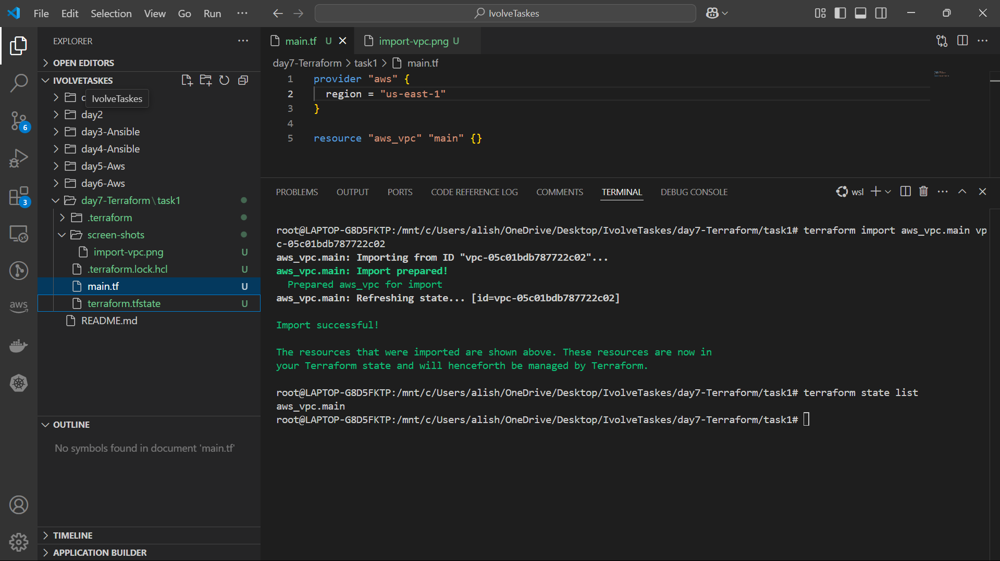
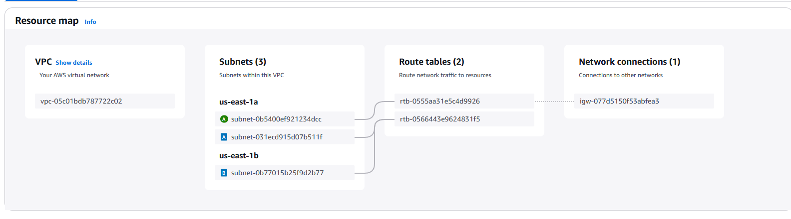
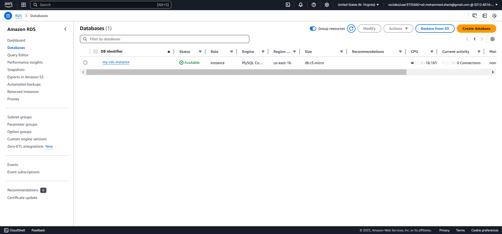
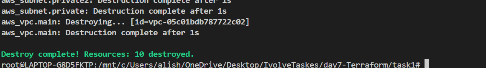

# Terraform Multi-Tier Application Deployment

## Overview
This project deploys a multi-tier application on AWS using Terraform, including:
- A VPC with public and private subnets.
- An EC2 instance in the public subnet.
- An RDS instance in the private subnet.
- A local provisioner to store the EC2 public IP.

## Steps

### 1. Initialize Terraform
```sh
terraform init
```

### 2. Import Existing VPC
```sh
terraform import aws_vpc.main <VPC_ID>
```

### 3. Apply Terraform Configuration
```sh
terraform apply -auto-approve
```

### 4. Verify Resources
```sh
terraform state list
```

### 5. Destroy Resources
```sh
terraform destroy -auto-approve
```

---
## Screenshots
Here are the screenshots demonstrating the execution:

1. **vpc created** 

2. **import vpc** 

3. **subnets and igw created** 

4. **Ec2 running** 

5. **RDS created**

6. **Destroy**


