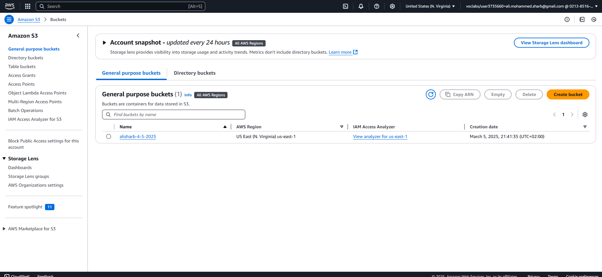
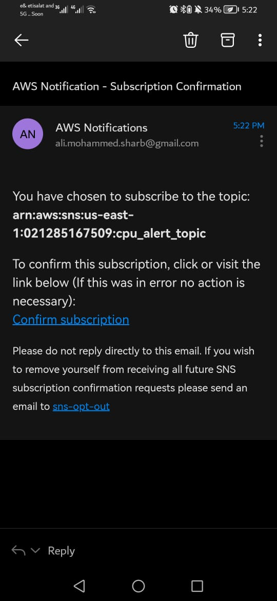
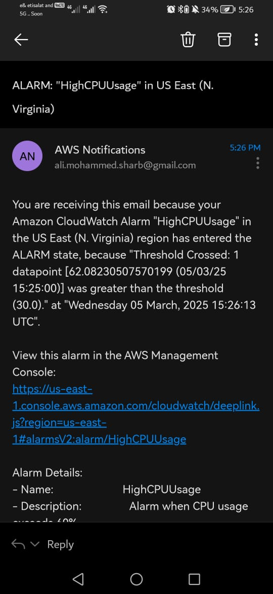
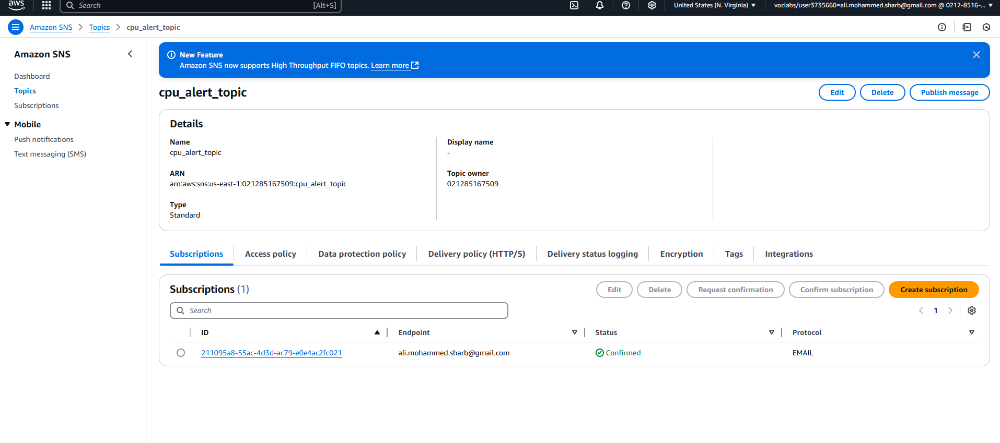
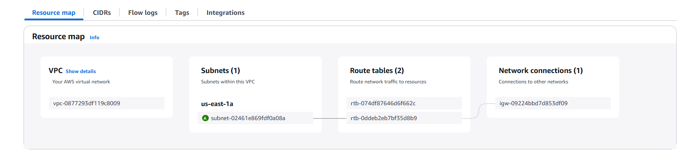

# Terraform AWS Infrastructure Deployment

## Overview
This Terraform configuration automates the deployment of an AWS infrastructure that includes:
- An **S3 bucket** for storing Terraform state
- A **VPC** with a public subnet
- An **Internet Gateway**
- A **Route Table** for public access
- An **EC2 instance** running **Nginx**
- A **Security Group** for EC2
- **CloudWatch monitoring** with SNS alerts for CPU utilization

## Configuration Details

### 1. Create an S3 Bucket for State Management
Run the following command to create an S3 bucket for Terraform state storage:
```sh
aws s3 mb s3://alisharb-4-5-2025 --region us-east-1

```

### 2️⃣ Infrastructure Resources
- **VPC**: Creates a private network (10.0.0.0/16).
- **Subnet**: Public subnet (10.0.1.0/24) in `us-east-1a`.
- **Internet Gateway**: Allows internet access.
- **Route Table**: Routes traffic through the Internet Gateway.
- **Security Group**:
  - Allows SSH (22) and HTTP (80) access from anywhere.
  - Allows all outgoing traffic.
- **EC2 Instance**:
  - Runs **Nginx** for web serving.
  - Installs **CloudWatch Agent**.
- **SNS & CloudWatch**:
  - Alerts when CPU utilization exceeds 60%.
  - Sends notifications to the configured email.

## Deployment Steps


1 **Initialize Terraform**
```sh
terraform init
```

2 **Check the Terraform Plan**
```sh
terraform plan
```

3 **Apply Terraform Configuration**
```sh
terraform apply -auto-approve
```

4 **Verify the Deployment**
- Check the **AWS Console** → **EC2** for the instance.
- Visit the EC2 **Public IP** to confirm Nginx is running.
- Verify the **CloudWatch Alarms** and **SNS Topics**.
- Ensure the **S3 bucket** contains `terraform.tfstate`.

## Cleanup
To destroy all created resources, run:
```sh
terraform destroy -auto-approve
```


---
## Screenshots

Here are the screenshots demonstrating the execution:

1. **s3 bucket** 

2. **confirm email** 

3. **alert email** 

4. **sns** 

5. **vpc created**

6. **Destroy**

